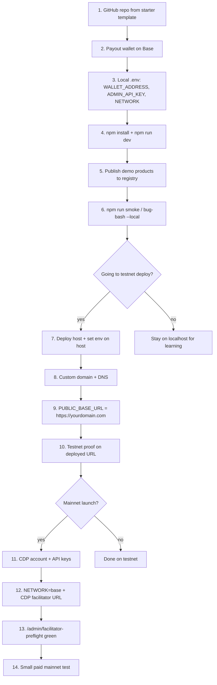

# 00 - Accounts And Environment Setup

> **Available today:** yes
> **Requires terminal:** yes

Before you clone the starter or run your first smoke test, it helps to know what you are wiring together and in what order. This chapter is the detailed reference for accounts, environment variables, and deployment choices. For a short ordered checklist, start with [`00-happy-path.md`](00-happy-path.md).

## Overview

Curatoria is a small Node.js service that sells your digital products to AI agents with [x402](https://docs.x402.org). You host the service, point a domain at it, and keep your product files in storage you control.

You are connecting four layers:

| Layer | What it does | Where it lives |
| --- | --- | --- |
| **Paywall service** | Serves discovery, catalog, and paid routes; verifies x402 payments | Your deployed Node app (Vercel, Railway, Fly, VPS, etc.) |
| **Discovery** | Free teaser at `/.well-known/design-catalog.json`; full metadata at paid `GET /catalog` | Same service |
| **Storage** | Product bytes (markdown, zip) fetched only after payment | Local `design-systems/`, Google Drive, Dropbox, or HTTPS URL |
| **Settlement** | x402 facilitator verifies and settles USDC on Base | Testnet: `x402.org`; mainnet: Coinbase CDP facilitator |

Your payout wallet receives USDC. The facilitator handles payment verification — you do not run a blockchain node.

See [`01-before-you-start.md`](01-before-you-start.md) for how discovery, challenge, payment, and delivery fit together.

## Dependency Order

Create and configure things in this order. Skipping ahead causes confusing failures (wrong `base_url`, facilitator 401, unpaid 402 with no products).



Numbered list (same sequence):

1. **Fork or create a repo** from [curatoria-starter](https://github.com/margaretsommers/curatoria-starter).
2. **Payout wallet** — EVM address that receives USDC on Base (see [`02-wallet-basics.md`](02-wallet-basics.md)).
3. **Local `.env`** — at minimum `WALLET_ADDRESS`, `ADMIN_API_KEY`, `NETWORK=base-sepolia`.
4. **Run locally** — `npm install`, `npm run dev`, confirm `/health`.
5. **Registry + products** — demo files in `design-systems/` or publish with CLI (see [`04-products-and-prices.md`](04-products-and-prices.md)).
6. **Local gates** — `npm run smoke` and `npm run bug-bash -- --local`.
7. **Deploy host** — connect repo, set env vars in the host dashboard (see [`07-go-live.md`](07-go-live.md)).
8. **Domain + DNS** — point your domain at the host; wait for TLS.
9. **`PUBLIC_BASE_URL`** — set to `https://yourdomain.com` so catalog and x402 `resource.url` values are absolute HTTPS URLs (critical behind reverse proxies).
10. **Testnet on production URL** — rerun smoke/bug-bash against the deployed base URL.
11. **CDP account** (mainnet only) — API keys for the Coinbase x402 facilitator.
12. **Mainnet env** — `NETWORK=base`, `FACILITATOR_URL=https://api.cdp.coinbase.com/platform/v2/x402`, `CDP_API_KEY_ID`, `CDP_API_KEY_SECRET`.
13. **Facilitator preflight** — `GET /admin/facilitator-preflight` with `X-Admin-Key` returns `ok: true` (no USDC spent).
14. **Catalog paywall config** — `CATALOG_PRICE_USD` or `owner.catalog_price_usd` in registry (see [`04-products-and-prices.md`](04-products-and-prices.md)); optional `CATALOG_PAYWALL_BYPASS=1` for local dev only.

Storage connectors (Google Drive, Dropbox, URL) can be added any time after local publish works — see [`03-connect-your-storage.md`](03-connect-your-storage.md).

## Accounts To Create

### Coinbase Developer Platform (CDP)

| | |
| --- | --- |
| **What for** | Mainnet x402 facilitator authentication. Required when `FACILITATOR_URL` points at Coinbase's hosted facilitator. |
| **Signup** | [portal.cdp.coinbase.com](https://portal.cdp.coinbase.com) |
| **Free tier** | Developer portal and testnet faucet are free. Mainnet settlement uses real USDC from buyers — no separate facilitator subscription for basic x402 seller use, but you need valid API keys with x402 permissions. |
| **When** | Before Base mainnet launch, not for local or Base Sepolia testnet (testnet uses `https://x402.org/facilitator` without CDP keys). |

Create an API key pair (`CDP_API_KEY_ID` + `CDP_API_KEY_SECRET`) and store both in your host's secret manager. See [`07-go-live.md`](07-go-live.md) for preflight.

Also use CDP for the [Base Sepolia test ETH faucet](https://portal.cdp.coinbase.com/products/faucet) when funding your test payout wallet.

### Coinbase Wallet (payout wallet)

| | |
| --- | --- |
| **What for** | Receiving settled USDC from x402 payments. This is your **seller** wallet — the address in `WALLET_ADDRESS`. |
| **Signup** | [coinbase.com/wallet](https://www.coinbase.com/wallet) or any EVM wallet that supports Base USDC |
| **Free tier** | Free to create. Testnet assets from faucets have no real value. |
| **When** | Before first `npm run dev` (server refuses to start without a valid payout address). |

Detailed steps: [`02-wallet-basics.md`](02-wallet-basics.md).

### Coinbase agent wallet / awal (optional — buyer testing)

| | |
| --- |
| **What for** | Paying your own `402` challenges during optional paid proof (`npm run bug-bash -- --paid`). Simulates what an agent buyer does. |
| **Signup** | Authenticate via `npx awal@2.10.0 auth login` after installing the Coinbase MCP / awal tooling |
| **Free tier** | Testnet USDC from Circle faucet; mainnet requires real USDC in the buyer wallet |
| **When** | Only if you want automated paid self-proof. **Not required** to clone, run smoke tests, or launch — most creators validate unpaid `402` responses and let real agents pay first. |

Set `AWAL_PAID_TEST=1` only after awal is authenticated and the buyer wallet is funded. See [`06-test-on-testnet.md`](06-test-on-testnet.md).

### Vercel

| | |
| --- | --- |
| **What for** | Hosting the Node service as serverless functions. The reference implementation at [curatoria.dev](https://curatoria.dev) runs on Vercel. |
| **Signup** | [vercel.com](https://vercel.com) |
| **Free tier** | Hobby tier works for early testing; set env vars in Project → Settings → Environment Variables. |
| **When** | When you want a public HTTPS URL without managing a VM. |

The service exports a Vercel-compatible handler (`src/server.ts`). Connect your GitHub repo, set build/start per your `package.json`, and add all production env vars in the dashboard.

**Note:** Margaret's live deployment uses Vercel + custom domain. This is the proven path in the operator repo; other hosts work too.

### Domain registrar / DNS

| | |
| --- | --- |
| **What for** | Stable catalog URL for agents (`https://yourdomain.com/.well-known/design-catalog.json`) and correct `PUBLIC_BASE_URL`. |
| **Signup** | Any registrar (Cloudflare, Namecheap, Google Domains, etc.) |
| **Free tier** | Vercel provides `*.vercel.app` subdomains for free; custom domains require a registrar. |
| **When** | After deploy works on the default host URL; before sharing your catalog publicly. |

Point DNS to your host per their docs, then set `PUBLIC_BASE_URL=https://yourdomain.com` in production env.

### Railway

| | |
| --- | --- |
| **What for** | **Not used by the Curatoria reference deployment.** Railway appears in docs only as one of several managed Node hosts you *can* use. |
| **Signup** | [railway.app](https://railway.app) |
| **Free tier** | Limited trial/credits; good for long-running Node processes if you prefer Railway over Vercel serverless. |
| **When** | Optional alternative to Vercel, Fly.io, or Render — see [`appendix-self-host.md`](appendix-self-host.md). |

There is no Railway config file in the starter repo. If you choose Railway, connect the repo, set the same env vars as Vercel, use `npm run build` + `npm run start`, and set `PUBLIC_BASE_URL` to your Railway public URL or custom domain.

### Google Drive / Dropbox (storage — not a Curatoria account)

| | |
| --- | --- |
| **What for** | Keeping product files out of git while the server fetches bytes after payment. |
| **Signup** | Use your existing Google or Dropbox account |
| **Free tier** | Standard free storage tiers apply |
| **When** | When local `design-systems/` files are not your production path |

No Curatoria-specific signup. For Google Drive, share each file as **Anyone with the link can view**. Optional `GOOGLE_API_KEY` helps with private or large files. See [`03-connect-your-storage.md`](03-connect-your-storage.md).

Dropbox Mode B (private paths) needs a Dropbox app and OAuth refresh token (`DROPBOX_APP_KEY`, `DROPBOX_APP_SECRET`, `DROPBOX_REFRESH_TOKEN`).

### GitHub

| | |
| --- | --- |
| **What for** | Hosting your fork of curatoria-starter and connecting to Vercel/Railway for deploy. |
| **Signup** | [github.com](https://github.com) |
| **Free tier** | Public repos free |
| **When** | First step — create repo from the starter template |

## Environment Variables Reference

Copy `.env.example` to `.env` locally. Never commit `.env`. Set the same variables in your host's secret manager for production.

| Variable | Required? | Where to get it | Used for | Testnet vs mainnet |
| --- | --- | --- | --- | --- |
| `WALLET_ADDRESS` | **Yes** | Your Base-compatible EVM receive address | x402 `payTo`; shown in `/health` | Same address format; use a dedicated test wallet on Sepolia |
| `WALLET_ENS` | No | ENS name you control | Optional payout resolution (tried before `WALLET_ADDRESS`) | Same |
| `ADMIN_API_KEY` | **Yes** | You generate a long random string | `POST /admin/publish`, `/admin/facilitator-preflight` | Use different values per environment |
| `NETWORK` | **Yes** | You choose | `base-sepolia` or `base` | `base-sepolia` for testnet; `base` for mainnet |
| `PORT` | No (default `3000`) | Local dev only | Local `npm run dev` listen port | N/A on Vercel |
| `FACILITATOR_URL` | No (default testnet) | See below | x402 verify/settle endpoint | Testnet: `https://x402.org/facilitator`. Mainnet: `https://api.cdp.coinbase.com/platform/v2/x402` |
| `PUBLIC_BASE_URL` | Recommended for production | Your public `https://` origin | Absolute URLs in catalog JSON and x402 `resource.url` | Must be HTTPS in production |
| `CDP_API_KEY_ID` | Mainnet facilitator | [CDP Portal](https://portal.cdp.coinbase.com) → API keys | Auth headers for Coinbase facilitator | Not needed for `x402.org` testnet path |
| `CDP_API_KEY_SECRET` | Mainnet facilitator | Same CDP key creation flow | Paired secret for facilitator auth | Both ID and secret required; legacy `COINBASE_CDP_API_KEY` alone is not enough |
| `CATALOG_PRICE_USD` | No (default `0.001`) | You choose (e.g. `0.001`) | Per-fetch x402 price for `GET /catalog` | Same unit: USDC dollars as decimal string |
| `CATALOG_PAYWALL_BYPASS` | No | Set to `1` locally only | Skips catalog paywall middleware | **Local dev only** — never set in production |
| `AWAL_PAID_TEST` | No | Set to `1` when running paid bug-bash | Opt-in gate for spending test/mainnet USDC in scripts | Optional; see [`06-test-on-testnet.md`](06-test-on-testnet.md) |
| `GOOGLE_API_KEY` | No | Google Cloud Console, Drive API enabled | Fetch private/large Drive files | Optional if files are public link-shared |
| `STORAGE_MAX_BYTES` | No (default 50 MB) | You choose | Max remote file size for url/gdrive fetch | Same |
| `STORAGE_FETCH_TIMEOUT_MS` | No (default 15000) | You choose | Remote storage fetch timeout | Same |
| `DROPBOX_APP_KEY` | Mode B only | Dropbox app console | OAuth refresh for private Dropbox paths | Mode A link-share needs no Dropbox env vars |
| `DROPBOX_APP_SECRET` | Mode B only | Dropbox app console | OAuth refresh | Mode B only |
| `DROPBOX_REFRESH_TOKEN` | Mode B only | Dropbox OAuth flow | Long-lived access for private files | Mode B only |

### Facilitator URLs by network

| `NETWORK` | Recommended `FACILITATOR_URL` | CDP keys needed? |
| --- | --- | --- |
| `base-sepolia` | `https://x402.org/facilitator` | No |
| `base` | `https://api.cdp.coinbase.com/platform/v2/x402` | Yes (`CDP_API_KEY_ID` + `CDP_API_KEY_SECRET`) |

If you point mainnet at the CDP URL but omit keys, facilitator calls fail. If you set CDP URL on testnet, the service may still route Sepolia to `x402.org` internally — prefer explicit testnet URL in `.env` to avoid confusion.

### Catalog price resolution

Catalog access fee resolves in order:

1. `CATALOG_PRICE_USD` env override (if set)
2. `owner.catalog_price_usd` in `design-systems/.registry.json`
3. Default `0.001` USDC

## Easy Vs Hard

| Step | Difficulty | Notes |
| --- | --- | --- |
| Clone, `npm install`, copy `.env.example` | **Easy** | ~10 minutes |
| Set payout wallet + `ADMIN_API_KEY`, run `npm run dev` | **Easy** | Server validates wallet on startup |
| Publish local demo products, `npm run smoke` | **Easy** | Unpaid 402 checks need no buyer wallet |
| `npm run bug-bash -- --local` | **Easy–medium** | Two-tier catalog checks; use `CATALOG_PAYWALL_BYPASS=1` locally if you want full catalog JSON without paying |
| Fund testnet wallet (ETH + USDC) | **Medium** | Two faucets; confirm assets on Base Sepolia |
| Deploy to Vercel + env vars | **Medium** | Familiar if you've deployed Node apps before |
| Custom domain + `PUBLIC_BASE_URL` | **Medium** | DNS propagation; verify `base_url` in teaser JSON |
| Optional awal paid proof | **Medium–hard** | Buyer wallet auth, funding, `AWAL_PAID_TEST=1` |
| Mainnet + CDP facilitator + preflight | **Harder** | API key permissions, `/admin/facilitator-preflight`, real USDC |
| Google Drive / Dropbox production storage | **Medium** | Sharing settings and publish flags — config, not new code |
| Catalog paywall tuning | **Easy** (once code synced) | Env or registry field only |

## Minimal Path Vs Production Path

### Minimal path — local demo

Goal: understand the service on your laptop.

```bash
git clone https://github.com/YOUR_NAME/curatoria-starter.git
cd curatoria-starter
npm install
cp .env.example .env
# Edit: WALLET_ADDRESS, ADMIN_API_KEY, NETWORK=base-sepolia
npm run dev
npm run smoke
```

You get: `/health`, free teaser at `/.well-known/design-catalog.json`, unpaid `402` on paid routes. No deploy, no CDP, no custom domain, no storage connectors.

Optional: `CATALOG_PAYWALL_BYPASS=1` to read full `/catalog` JSON locally without paying.

### Testnet path — public URL, fake money

Add to minimal:

- Deploy to Vercel (or Railway/Fly/Render)
- `PUBLIC_BASE_URL=https://your-test-domain.com`
- `NETWORK=base-sepolia`, `FACILITATOR_URL=https://x402.org/facilitator`
- Fund test payout wallet from CDP + Circle faucets
- `npm run bug-bash -- --local` against deployed `BASE_URL` if testing remotely

Still no CDP keys. Optional paid proof with awal.

### Production path — Base mainnet, real USDC

Add to testnet:

- `NETWORK=base`
- Mainnet payout wallet (real Base USDC address)
- `FACILITATOR_URL=https://api.cdp.coinbase.com/platform/v2/x402`
- `CDP_API_KEY_ID` + `CDP_API_KEY_SECRET` in host secrets
- Green `/admin/facilitator-preflight` before accepting buyer payments
- `CATALOG_PRICE_USD` or registry `catalog_price_usd` set intentionally
- Production storage (Drive/Dropbox/URL) with public-link or OAuth config
- DMCA/support contact published (see [`07-go-live.md`](07-go-live.md))

Run a small paid purchase yourself or via awal before broad agent outreach.

## Common Failure Modes

### CDP facilitator returns 401

**Symptoms:** `/admin/facilitator-preflight` shows `ok: false`; mainnet paid requests fail after challenge.

**Causes:** Missing `CDP_API_KEY_SECRET`, wrong key ID, revoked keys, or key without x402 facilitator scope.

**Fix:** Create a fresh CDP API key pair. Set **both** `CDP_API_KEY_ID` and `CDP_API_KEY_SECRET` in the environment your deployed app actually reads (redeploy after Vercel env changes). Rerun preflight — expect `cdpAuthConfigured: true` and `supportsNetwork: true`.

Do not proceed to paid mainnet proof until preflight passes.

### Facilitator preflight fails on testnet

**Symptoms:** 502 from preflight with testnet network.

**Causes:** Wrong `FACILITATOR_URL`, outbound network blocked, or typo in `NETWORK`.

**Fix:** Use `NETWORK=base-sepolia` and `FACILITATOR_URL=https://x402.org/facilitator`. Confirm `/health` shows `network: "base-sepolia"`.

### Wrong `NETWORK`

**Symptoms:** Challenge shows unexpected chain (e.g. mainnet asset on Sepolia wallet); payments never settle.

**Fix:** Match `NETWORK` to the wallet you funded and the facilitator URL. Sepolia wallet + `base-sepolia` + x402.org; mainnet wallet + `base` + CDP facilitator.

### `base_url` or `resource.url` is `http://` or wrong host

**Symptoms:** Agents see localhost URLs in production catalog; x402 clients reject relative or HTTP resource URLs.

**Causes:** Missing `PUBLIC_BASE_URL` behind Vercel/reverse proxy; DNS not pointed yet.

**Fix:** Set `PUBLIC_BASE_URL=https://yourdomain.com` (no trailing slash). The service sets `trust proxy` and reads `X-Forwarded-Proto`, but explicit `PUBLIC_BASE_URL` is the reliable fix. Verify:

```bash
curl -s https://yourdomain.com/.well-known/design-catalog.json | jq .paid_catalog_url
```

### `/catalog` always 402 (expected) or never returns metadata after pay

**Symptoms:** Unpaid `/catalog` should return x402 `402` — that is correct. After payment, each new `GET /catalog` requires a **new** payment (per-fetch model, no session).

**Fix:** If testing locally without paying, set `CATALOG_PAYWALL_BYPASS=1` in `.env` only. In production, agents must pay per catalog fetch. See [`08-bazaar-listing.md`](08-bazaar-listing.md).

### Google Drive file not found or 502 after payment

**Symptoms:** Paid asset route returns 502; logs mention source resolution.

**Causes:** File not shared publicly; folder link instead of file link; wrong file ID in registry.

**Fix:** Share the **file** as "Anyone with the link can view". Republish with correct `--gdrive-id`. Optional `GOOGLE_API_KEY` for private files.

### Server exits on startup

**Symptoms:** `ERROR: ADMIN_API_KEY env var is required` or wallet resolution error.

**Fix:** Set `ADMIN_API_KEY` and a valid `WALLET_ADDRESS` (or resolvable `WALLET_ENS`).

### Paid bug-bash skips

**Symptoms:** `SKIP paid (set AWAL_PAID_TEST=1...)`.

**Fix:** This is intentional. Authenticate awal, fund buyer wallet, then `AWAL_PAID_TEST=1 npm run bug-bash -- --local --paid`. Not required for launch.

## Related Chapters

- [`00-happy-path.md`](00-happy-path.md) — ordered checklist
- [`02-wallet-basics.md`](02-wallet-basics.md) — payout wallet detail
- [`03-connect-your-storage.md`](03-connect-your-storage.md) — Drive, Dropbox, URL
- [`06-test-on-testnet.md`](06-test-on-testnet.md) — Base Sepolia proof
- [`07-go-live.md`](07-go-live.md) — mainnet deploy and preflight
- [`09-troubleshooting.md`](09-troubleshooting.md) — more failure modes
- [`appendix-self-host.md`](appendix-self-host.md) — Railway, Fly, VPS options
